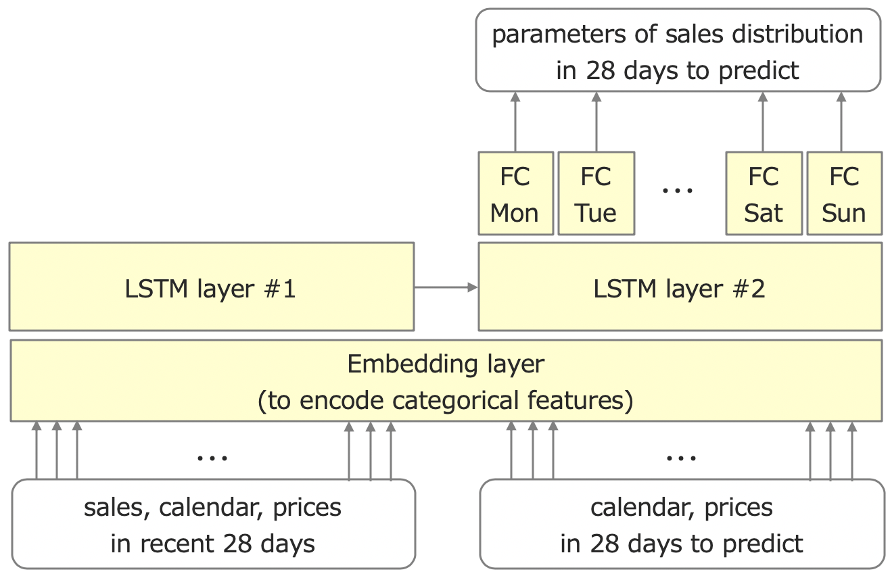
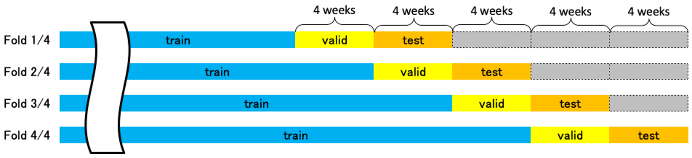

# Model Summary

M5 Forecasting - Uncertainty 4th Place Solution Model Summary.

## TOC

1. [Overview](#a1)
2. [Model Summary](#a2)
3. [Acknowledgment](#a3)

## 1. Overview

### 1-1. Scores and Places

| item | content |
|---|---|
| Competition Name | M5 Forecasting - Uncertainty |
| Team Name | Marisaka Mozz |
| Private Leaderboard Score | 0.15958 |
| Private Leaderboard Place | 4th |

### 1-2. Background on me

| item | content |
|---|---|
| Name | Mori Masakazu |
| Location | Japan |
| Kaggle Profile | [https://www.kaggle.com/marisakamozz](https://www.kaggle.com/marisakamozz) You can send me an email by clicking on the "Contact User" link in this Kaggle Profile. |
| What is your academic/professional background? | I am a senior Machine Learning specialist in Japan Research Institute, Limited, which is a core technology company of SMBC Group ([https://www.smfg.co.jp/english/](https://www.smfg.co.jp/english/)). My specialty is to apply AI to actual business use cases in a banking industry.|
| Did you have any prior experience that helped you succeed in this competition? | I have some experiences applying deep learning to predict credit scores. Yet, this is the first time for me to tackle time series analysis and uncertainty prediction seriously. |
| What made you decide to enter this competition? | Time series analysis is a very important technique for financial business to predict performance of corporate customers, condition of the market and the economy etc. So, I thought that participating this competition could be valuable in terms of strengthening my capabilities which allowed me to apply Machine Learning to more variety of business use cases. |
| How much time did you spend on the competition? | 2 months |

## 2. Model Summary

### 2-1. Overview

* 2 neural network models with the same structure.
* One model predicts sales of individual items, and the other model predicts sales aggregated by all items, each category or each department.
* CV policies that go back 4 weeks or 8 weeks as one unit.
* Because of the seed problem, I did not use Validation Phase sales data to train the model which predicts sales of individual items.

### 2-2. Exploratory Data Analysis

I used these Notebooks as a guide.

* [Back to (predict) the future - Interactive M5 EDA](https://www.kaggle.com/headsortails/back-to-predict-the-future-interactive-m5-eda)
* [【日本語】Back to (predict) the future - M5 EDA 6/1版](https://www.kaggle.com/marutama/back-to-predict-the-future-m5-eda-6-1)

As you can see [4-Visual-Overview:-Time-series-plots](https://www.kaggle.com/marutama/back-to-predict-the-future-m5-eda-6-1#4-Visual-Overview:-Time-series-plots), there are some periods when items are not sold at all for many days. Even if a product is sold about 10 units on average, there are periods of time when it isn't sold at all for several months. For this reason, I thought it would be better to model the distribution of sales of individual items with a negative binomial distribution.

On the other hand, When sales are aggregated by all items, each category or each department, the distribution is quite different. The distribution seems a normal distribution. Therefore, I thought it would be better to model the distribution of sales aggregated by all items, each category or each department with a normal distribution or a Student's T-distribution.

In summary, I have decided to create the following two models.

* A negative binomial distribution model which predicts sales of individual items (I call it "Each Model" from here)
* A normal distribution or Student's T-distribution model which predicts sales aggregated by all items, each category or each department (I call it "Agg Model" from here)

### 2-3. Model Structure

Here is the model structure.

This model is a neural network which takes features of sales, calendar and prices in recent 28 days and features of calendar and prices in 28 days to predict as input, and outputs parameters of sales distribution in 28 days to predict.
It consists of an embedding layer that encodes categorical features, two LSTM layers that process time series data, and 7 fully-connected layers for each day of the week.
Both "Each Model" and "Agg Model" have the same structure except that "Agg Model" does not use features of prices.

The final output layer was originally LSTM, but that didn't seem to be able to express the periodicity of day of the week well, so I made a dedicated fully-connected layer for each day of the week.

The parameters of the neural network are obtained by maximum likelihood estimation.
In other words, I compute the negative log-likelihood of actual sales in the distribution predicted by the model and optimize it so that it is minimized.

### 2-4. Feature Engineering

I did not do much feature engineering because I used the model structure shown above. The features I created are whether it is Christmas, whether it is a weekday holiday, the price trend (correlation coefficient with the date), etc. I created a model with LightGBM to predict sales using the created features as input, and I selected features by looking at the model's importance and Permutation Importance.

In creating the feature of whether it is a weekday holiday or not, I used [Federal Holidays USA 1966-2020](https://www.kaggle.com/gsnehaa21/federal-holidays-usa-19662020), which was raised in the Discussions of "M5 Forecasting - Accuracy".

I used PowerTransformer to bring the sales data of each time series close to a normal distribution for "Each Model".
On the other hand, for "Agg Model" I used raw sales data. I didn't preprocess them.
For example, a product that is sold one unit on average should have a very different distribution comparing with another one  that is sold ten units on average. I believe that adjusting the scale would greatly disrupt the shape of such a distribution, so I decided to do nothing. The other reason is that I wanted to put out the nine-quantile point as a discrete integer variable.

### 2-5. Cross Validation

In this competition I was worried about how to get the score of local Cross Validation.
Using TimeSeriesSplit of scikit-learn, for example, if n_splits=4, the training data for 5 years is divided into 5 equal parts, and the training data for the first fold has only 1 year data.
In that case, many products have not been sold yet, and it may be very different from the latest distribution, so it is not very useful.

Therefore, I decided to go back to the past with the time series data for each fold in 1 unit of 4 weeks. And I used the last 4 weeks as test data, the previous 4 weeks as validation data, and all remaining data as training data.

For example, in the case of the first fold when performing 4 CVs, the last 12 weeks of the training data of 5 years are removed. I use the last 4 weeks of the remaining data as test data, the previous 4 weeks as validation data, and the rest as training data.
The next fold removes the last 8 weeks and splits into testing, validation and training.
The third fold removes the last 4 weeks. The last fold uses all data.

At first, I was proceeding with this policy, but the period of validation data and test data was too short for 4 weeks.
The epoch of early stopping at each fold was completely different,
and the score at each fold was also completely different.
Probably because the distribution differs greatly every four weeks.
At the last minute, I changed the CV split policy from 1 unit of 4 weeks to 1 unit of 8 weeks.
However, the situation didn't change much.

I don't know if this method was correct.

I evaluated scores of diffrent models by using weighted loss of test data in Local CV.
Weights were calculated by sales in last 28 days of training data.
This made it possible to confirm whether the forecast was correct for time series data of higher importance. I didn't implement WSPL, which is the evaluation index of the competition, because it took a long time to process and it was troublesome.

### 2-6. Seed Problem

Another thing I was worried about was that I had a problem that the score changed greatly depending on the seed.
"Agg Model" is prone to over fitting because there are few variations in time series data, and that probably caused the seed problem.
I tried to reduce the number of nodes in the hidden layer, put dropout, put weight_decay, and various over-fitting measures, but until the end, this problem was not solved.

The annoyance of this problem is that it's hard to distinguish whether the improvement in score is due to my efforts or just a good seed.
Therefore, when performing a hyperparameter search, I compared the average values of the results from multiple different seeds.

When selecting the final submission,
I decided not to use the published validation phase sales data (from April 25 to May 22, 2016) as one of training datasets, and I created models from various seeds.
Then, I chose the one with the highest Public Leaderboard score I tried.
The decision not to use the validation phase sales data for training was a big challenge, but as a result, this policy allowed me to select a good seed.

This problem was not occurred in "Each Model".
So, I trained "Each Model" using validation phase sales data.

### 2-7. Target Encoding

As mentioned above, "Each Model" did not transform the sales scale as a preprocess.
I was worried that I could make accurate predictions for products with particularly large sales.
So I added target encodings so that "Each Model" can use it to adjust the scale.

I decided to find the average value of sales for each time series and day of the week, and enter it before the final fully-connected layer.
To avoid the leak, I should use only the past data to calculate target encodings, but since there was no time, I did not take such a consideration and made it the average of all periods.

As a result, this feature was also useful for "Agg Model".

### 2-8. Other Details

To prioritize the most recent data, I oversampled the 2015 data by a factor of 2 and the 2016 data by a factor of 4.

Since the evaluation index is weighted by sales amount, I tried to weight loss by each time series data, which was effective in the "Each Model", but was not effective in the "Agg Model".

### 2-9. Tools

I implemented neural networks with PyTorch.
I used PyTorch-Lightning to process training loop, MLflow Tracking to manage experiments, and Hydra to input hyperparameters from YAML file.

The combination of Pytorch-Lightning and MLFlow is very convenient.
Even if you do not implement it yourself, it will leave a log of hyperparameters and loss.
If you want to leave your own score, you can use the API of `mlflow.tracking.MlflowClient`,
unlike the usual MLFLow implementation (eg `mlflow.log_metric("foo", 1)` etc.).
However, it is not particularly difficult if you know that.

On the other hand, although I used Hydra this time, the implementation was tied to Hydra's frame and I didn't get a good impression. For example, Hydra overwrites the content of the previous settings configured by `logging.basicConfig()`.

### 2-10. Model Execution Time

It took 1.5 hours to train "Each Model", and it took 10 minutes to 1 hour to train "Agg Model" (this depended on early stopping epochs).

As mentioned above, due to the seed problem, I had to train multiple times with different seeds to get the correct score.
Therefore, the hyper parameter search took time.

It took several minutes to generate predictions using trained "Each Model".
It took several seconds to generate predictions using trained "Agg Model".

## 3. Acknowledgment

I would like to appreciate the participants and the organizers of the competition.

This was the first time for me to participate in a Kaggle competition in such a serious way.
I really enjoyed participating the competition, and it was a big surprise for me to get such a great result.
I learned a lot of things through this competition.
I would like to use this experience in my future work.

Thank you.

End of document.